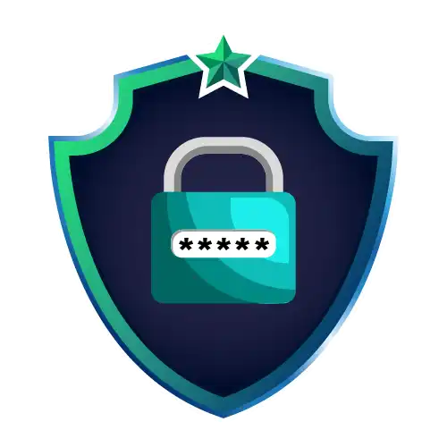

<div align="center">

# ⚡ Santander - Introdução a Cibersegurança

</div>

Repositório dedicado às atividades, desafios e projetos desenvolvidos durante o bootcamp **Santander - Cibersegurança** da [Digital Innovation One](https://www.dio.me/).


## 📌 Sobre o Bootcamp

Conheça de perto o pensamento estratégico e as habilidades essenciais de um hacker para antecipar ameaças e fortalecer a segurança dos seus sistemas.

Aprenda os conceitos mais avançados de cibersegurança com o Santander e prepare-se para identificar vulnerabilidades, aplicar técnicas de testes de invasão, explorar práticas de engenharia social, entender o funcionamento da deep web, anonimato digital e os fundamentos do hacking ético.

"A Cibersegurança é um conjunto de ações e técnicas para protejer sistemas, programas, redes e equipamentos contra invasões" - Cybersecurity & Infrastuture Security Agency  

<!-- ## 🛠 Tecnologias e Ferramentas
Durante o bootcamp, foram utilizadas diversas tecnologias e conceitos, incluindo:
- tech 1
- tech 2
- tech 3 -->

## Badges 

<table border="2">
  <tr>
    <td>
        <a href="#"></a>
    </td>
    <td>
        <a href="#"></a>
    </td>
    <td>
        <a href="#"></a>
    </td>
    <td>
        <a href="#"></a>
    </td>
      
  <!-- </tr>
  <tr>
    <td>
        <a href="#"></a>
    </td>
    <td>
        <a href="#"></a>
    </td>
    <td>
        <a href="#"></a>
    </td>
    <td>
        <a href="#"></a>
    </td>
      
  </tr> -->
</table>

<!-- 
## 📂 Estrutura do Repositório
O repositório está organizado da seguinte maneira:
```
📁 BootcampCyberSatander
 ┣ 📂 modulo-1
 ┃ ┣ 📜 atividade1.md
 ┃ ┣ 📜 atividade2.md
 ┣ 📂 modulo-2
 ┃ ┣ 📜 desafio1.md
 ┃ ┣ 📜 desafio2.md
 ┣ 📂 projetos
 ┃ ┣ 📂 projeto-final
 ┃ ┃ ┣ 📜 README.md
 ┃ ┃ ┣ 📜 Program.cs
 ┃ ┃ ┣ 📜 Startup.cs
 ┃ ┃ ┣ 📜 Controllers
 ┃ ┃ ┣ 📜 Models
 ┃ ┃ ┣ 📜 Services
 ┗ 📜 README.md
``` -->
<!-- 
## 📌 Atividades e Projetos
- **Módulo 1:** Principios 

- **Projeto Final:** Desafio Técnico -->

## 📜 Licença
Este projeto está sob a licença MIT. Sinta-se à vontade para utilizá-lo e adaptá-lo conforme necessário.


|     |
|:----------------------------:|
|        **Alice Sena**        |
| **Desenvolvedora FullStack** |


